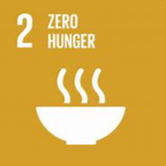
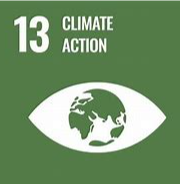
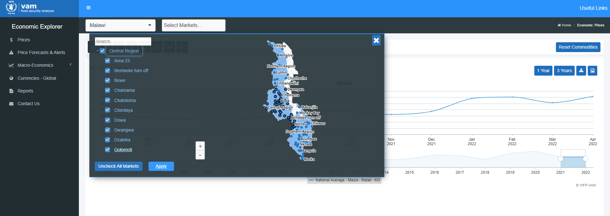
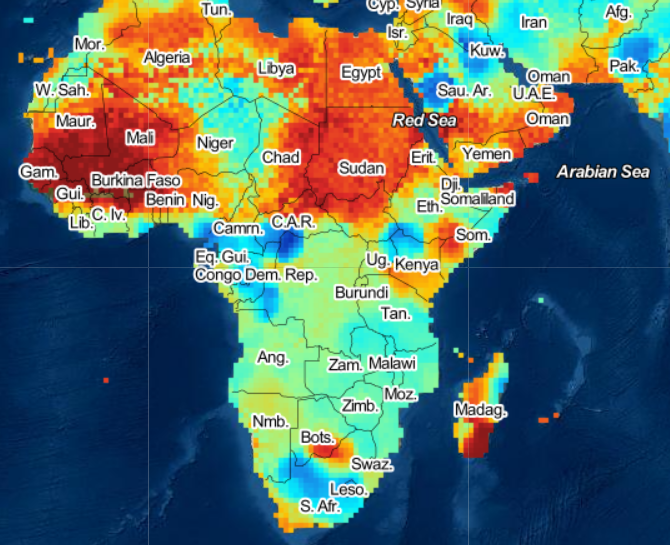

# Master Thesis 
## Food Security and Climate Shocks
### The Resilience of Food Prices to Droughts in Malawi. A Machine Learning Approach.

This is the GitHub repository corresponding to the Master Thesis of Lena B..

  

--------------------------------------------------------------------------
## Data
The data merges data on food prices for different commodities and markets provided by WFP, as well as climate data on droughts, based on the SPEI as a drought indicator.  

**The final dataset can be found [here](output/final-dta.xlsx)**.

## Structure 
### [input](input)
### Food price data

[Food prices](input/Malawi/food-price-dta/csv-prices) have been obtained via the open source database of WFP.  
Temporal Unit of analysis: Month  

_Source_:

- [WFP vam database](https://dataviz.vam.wfp.org/economic_explorer/prices)

Link used to extract data for central region [14.06.2022, 14:12]:  
- [Link](https://dataviz.vam.wfp.org/economic_explorer/prices)
### Coordinates of Markets
Further data upon [market coordinates](input/Malawi/food-price-dta/longs%20and%20lats) has been kindly provided upon request via the team of WFP.

### Climate data (drought)
  
_Screenshot: [SPEI Global Drought Monitor](https://spei.csic.es/spei_database/#map_name=spei01#map_position=1439)_
- [SPEI Global Drought Monitor](https://spei.csic.es/map/maps.html#months=1#month=4#year=2022)

- [Selection Malawi](https://spei.csic.es/map/maps.html#months=0#month=4#year=2022)
- [Global SPEI Database](https://spei.csic.es/database.html#p7)  

--------------------------------------------------------------
## Additional Useful Links

### WFP
- [VAM Resource Center](https://resources.vam.wfp.org/)
- [Overview Malawi Dataviz](https://dataviz.vam.wfp.org/version2/country/malawi)
